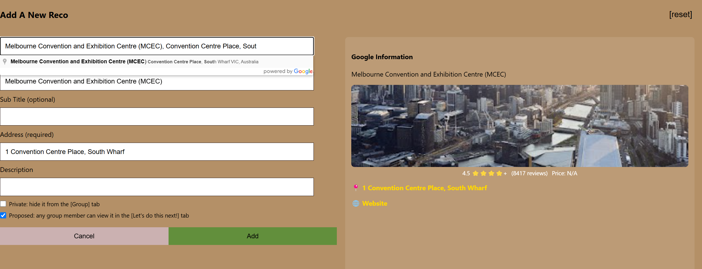
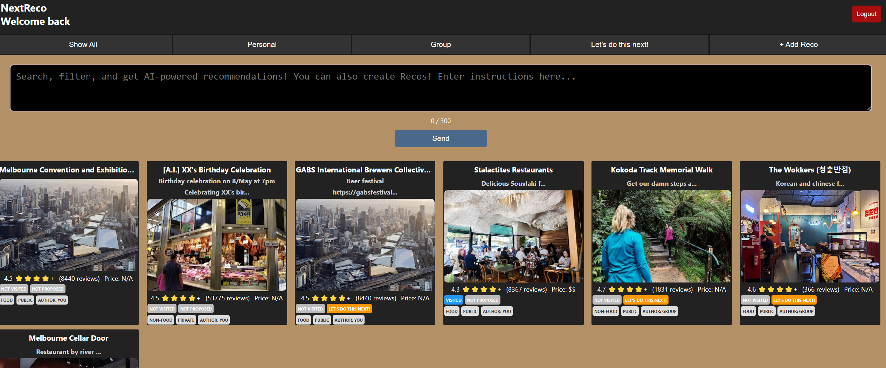
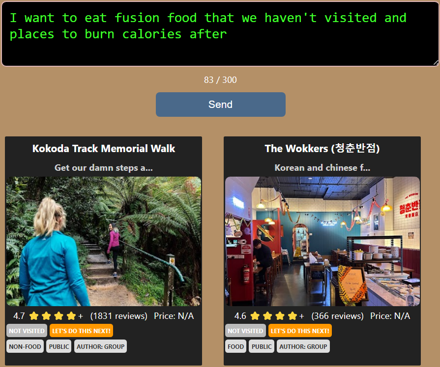
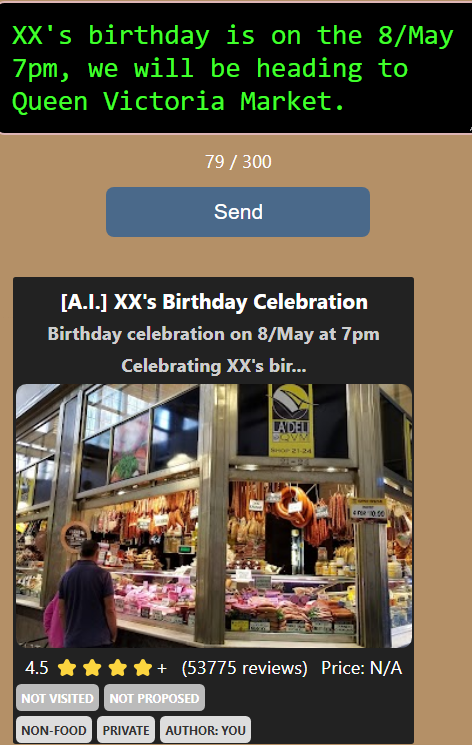

# NextReco: AI Powered Recommendations - Let's Do This Next!
**NextReco** is a full-stack **MERN app** where you can organise and share recommendations ("Recos") in food and activities to do with friends. Instead of manually selecting filters, NextReco integrates Generative AI allowing you to:
- search (and ask for recommendations!) with natural language instead of fiddling with filters, and without the need for precise wording in search bars
- Create recos with the help of AI
- Organise and share Recos effortlessly with your mates, eliminating endless reposting and in group chats

This Project is deployed and being actively maintained!

I built this app in attempt to answer the question: “What if Generative AI could make searching as easy as just describing what you want?”

## Core Features
### Search locations using the Google Places API
### Google Sign Up/Log In via Firebase Authentication
### Post, Edit, and Share Recommendations ("Recos") to the group
### Smart Text-based search and filtering via AI
Simply use Natural Language to describe what you are looking for, and the AI will return relevant Recos to you in a context-aware manner!
- eliminates the need to fiddle with filters
- no need to have precise wording in search bars
- ie: "I want to eat fusion food that we haven't visited and places to burn calories after"
### Creation of Recos via AI
Describe what you want to recommend to the group, and the AI will structure it into a Reco for you!
- if it infers it is a public location, the AI assistant will generate an address
- ie: "XX's birthday is on the 8th of May 7pm, we will be heading to Queen Victoria Market for the foodie night market."

## Requirements
### Functional
- Users can sign up and log in securely via Firebase Authentication
- Users can post, view, edit, and delete recommendations ("Recos")
- Users can make Recos private or propose to a shared group
- Users can search for locations using the Google Places API (real-time autofill)
- Users can find Recos using A.I-powered search and filtering
- Users can create new Recos through the AI

### Non-Functional
- UI must be intuitive and responsive
- Backend must be able to handle at least 10 users within <3 second delay
- The application needs to be available at least 16 hours a day

## Technologies Used
- **MongoDB** => database for storing Recos 
- **Mongoose** => standardisation of Reco Schemas 
- **Express.js + Node.js** => execution of js from server side
- **React.js** => frontend UI
- **Firebase Authentication** => user authentication with Google Sign-In
- **Google Places API** => fetches location data real-time
- **OpenAI API** => AI powered search and filtering
- **Render** => where the Backend server is deployed
- **Netlify** => where the Frontend app is deployed 

## Screenshots
**!!! Disclaimer !!!**
Please note that **NextReco is an independent project** and is **not affiliated with or endorsed by any of the restaurants, locations, or activities listed in the app**. The recommendations displayed are user-generated and for informational purposes only.

### Using Google Places API to autofill recommendations ("Recos")

### Look at Shared Recos, and propose them to the group!

### Using AI to search and filter Recos with natural language

### Using AI to create new Recos

## Limitations and Further Areas of Improvement:
### Was this app a great solution to the question? (or What went wrong?)
“What if Generative AI could make searching as easy as just describing what you want?”

**Short Answer: No, if planning to scale**
- sometimes, AI didn't know whether a  place existed, thus confused between [create-lookup] and [create-manual]
- token limit bottlenecks, (see addendum), filtering may unexpectedly cutoff some Recos, when # Recos > 48
- ineffective prompt engineering: 
- (1) determining want the user prompt wants the AI to do (the [category-mode]) shouldn't need a Reco passed in (or even an entire list of Recos)
- (2) invalid JSON may sometimes be returned when uncategorised
- it cannot list Recos in a certain order ("by date created")

### How to proceed from here?
- don't assume A.I. knows a physical location (that's the job of the Google Places API)
- increase max_tokens output to match input size (see calculations)
- should separate concerns, have one prompt focused on categorising, the other prompt in generating the Reco object
- need to explicitly show MORE examples of expected INPUT and OUPUT, and have a fallback [uncategorised] category 
- finally, the gpt-4o-mini model may even be the incorrect model for this task, may require a more "heavy weight" model like gpt-4o that (in theory) handles much better in intensive data processing tasks.

## Live Web Application
If you found this project interesting and would like to explore the app, here is the link.

[NextReco: AI Powered Recommendations - Let's Do This Next!](https://incandescent-ganache-a6c8d3.netlify.app/)

## Addendum: Calculations
### Limitations and constraints
- gpt-4o-mini rate limiting => 60k tokens/min, 500 requests/min
- gpt-4o-mini token limits => 128k in, 16,384 out
- gpt-4o-min costs => $0.15 per million tokens, $0.85
- this 
#### Output
- output is a list of Reco.IDs => { "data":["67ca7480d773ddf3c2a28b54"] } => ~21 tokens each
- set max_tokens: 1024 => AI output suports max of ~48 Reco IDs 
- (I could use ints instead of strings for the ID, but lets look at current implementation)
#### Input
- in current implementation, 
- average Reco requires ~300 tokens (assuming description stays under 200 chars)
- system prompt requires ~500 tokens
- user prompt requires ~80 tokens (300 char limit enforced)
- => A.I could in theory, support the processing of ~420 Recos at a time (assuming no hallucination)

If want output to match input size, then increase max_tokens = ~9k

## Prompt Engineering
### Determining the category of user request
You are an AI that processes user requests into structured Reco objects.
First, classify the request into one of the below categories based on the user:
- [create-lookup] finding an restaurant, point of interest, venue, or business on google maps, and clearly a public location
- [create-manual] the address or location is a personal or private
- [update-mode] updating an existing reco, while taking into account of user supplied reco.
- [delete-mode] deleting an existing reco.
- [sort-filter] user wants or needs the sorting filtering or recommendation of recos, for example: I want to... Recommend me... Find a place(s) that...  I want Greek cuisine... I want to go to public location
- [invalid] the user request does not match any of the above categories

Then based on the mode, generate the appropiate JSON response:
if [create-manual or create-lookup], generate a Reco with details fill in.
if [update-mode], modify the user given reco, you MUST take into account of the reco supplied by user.
if [delete-mode], return the deletion criteria as deleteCriteria AND the categoryMode.
if [sort-filter], return ONLY the categoryMode, no other attributes are to be included.
if [invalid], return ONLY the categoryMode, no other attributes are to be included.

Reco Mongoose Schema:
{
  "categoryMode": "classification label"| without the [],
  "title": (string, required),
  "subTitle": (string, optional | punchline of any dates, deals or important info),
  "category": (either "food" or "non-food"),
  "address": (string, if in [create-lookup] infer at least a suburb or a city name and return venue name and location together for the sake of google places api, for example: Cool Place, Suburb, or Cool Place 2, City),
  "description": (string, optional),
  "isPrivate": (boolean, default true) ,
  "isProposed": (boolean, default false),
  "placeID": (null unless supplied by reco ONLY),
  "uid": (null unless supplied by reco ONLY),
  "isVisited": (false unless supplied by reco ONLY),
  "_id": (discard this attribute entirely unless supplied by reco ONLY)
}
If the subTitle, description was generated by you, at the start of the tile string put [AI] including space and brackets

return only valid json, nothing else

- around 2226 chars => 517 tokens

### Determining the subset of Recos to return based on user request
You are an AI the processes user requests and a structured list of Recos
First, you must always follow the below ruleset:
- always receive a list of Reco objects as input
- always return a list of Reco._id extracted from given list as output
- you must ONLY do tailoring on the given list, not modify its contents
- tailoring means to be aware of recos in a context aware way

Tailoring:
- you must take into account of each Reco's attibutes
- you must analyse also the text within the title, subTitle, description, and address to determine which recos match user's needs
- you must understand what the user wants and try to match them to the recos

Reco Mongoose Schema:
{
  "title": (string),
  "subTitle": (string),
  "category": (either "food" or "non-food"),
  "address": (string),
  "description": (string),
  "isPrivate": (boolean | means only the user can see it) ,
  "isProposed": (boolean | means it appears under the [Let's do this next!] tab, where it is proposed),
  "placeID": (string | means whether it is a verified place that can be found on google maps),
  "uid": (string | determines the user who authored a reco),
  "isVisited": (boolean | means whether the user has marked it visited or completed or finished),
  "_id": (string)
}

expected output:
{ "data":[], }

return only valid json, nothing else

- around 1324 chars => 326 tokens